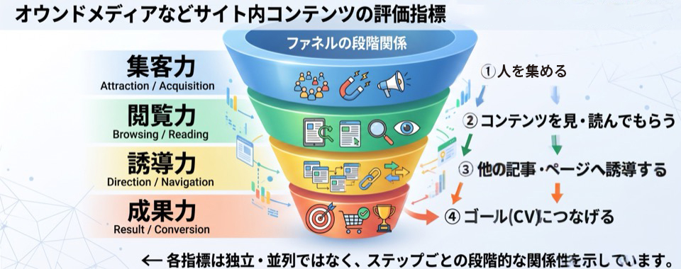

# 第1章 Webサイト分析・改善の基本プロセス & 心得

**章概要**: Webサイト分析の全体心得、ユーザー/アナリスト視点、ファネル4指標（集客力・閲覧力・誘導力・成果力）、仮説出し手法、E-E-A-T基準。

[← 総合目次（00_index.md）に戻る](00_index.md)

## 本章の節一覧

- [1-1. サイト分析の心得と基本プロセス（5ステップ）](#sec-1-1)
- [1-2. 施策立案の大まかな流れ & アプローチ手法](#sec-1-2)
- [1-3. ボリュームゾーンの見つけ方（集客力・閲覧力・誘導力・成果力）](#sec-1-3)
- [1-4. 閲覧力と誘導力の分析手法 & 離脱防止テクニック](#sec-1-4)
- [1-5. 仮説を立てる3つの方法 & Googleコンテンツ評価基準「E-E-A-T」](#sec-1-5)
- [1-6. GA4における優良コンテンツ量産アプローチ](#sec-1-6)
- [1-7. 成果力（しっかりCVにつなげられているか？）の分析とフォーム改善](#sec-1-7)

---

## 1-1. サイト分析の心得と基本プロセス（5ステップ）

1. 戦略（目標・目的）を立て、（先方の希望・要望があれば含む）
2. それを達成するための戦術（手段）を練り、
3. そのために必要な情報（参考・判断材料）を集める（整理する）。

### 〜サイト分析方法の一例〜

【情報収集・整理】【戦術（手段）を練る】

1. **ユーザー目線とアナリスト目線でサイト/ページを使って「所感」を得る**  
   （使い勝手や仮説［ごちゃごちゃして情報がまとまっていないので直帰や離脱率が高いのでは？サイト内回遊＝遷移してもらってないのでは？など デザイン的な課題の発見］）  
   ※トレンドとセグメントの2点から見つけるのも一つの方法
2. **得た所感を元に「仮説出し」（分析の方向性や改善点の抽出）を行い、それに基いてGoogle Analytics等のツールを使って解析・分析を始める**
3. **「改善施策の考案及び計画」を行う**  
   （当初から戦略〈目標・目的〉が決まっている場合はそれと）仮説出しにおける分析の方向性とビジネスロードマップ（指標・数値・期間の3項目から成るKPIをいくつか抽出・発見する上で活用できるチャート）の作成を通じて（改善箇所・KPIの選定）を行う。
4. **収集したレポート（データ）を加工していく**  
   （戦略〈あれば〉）仮説出しによる分析の方向性やビジネスロードマップから発見・選定したKPIに基づいて収集したレポート（データ）を加工していく。（＝グラフや表などを用いて分かりやすくする）  
   ※後々レポート（提案書）を作成する際にも活用するので第三者が見ても理解できる程のレベルにしておくことが重要
5. **レポート（提案書）にまとめて提出 or プレゼンを行う → 通れば実施**  
   （先方に提案〈持ち込み企画など〉する場合のみ）考案した改善施策や計画をまとめる。

> [!NOTE]
> ※施策内容と（加工した）データたちがカイリしないよう注意（＝整合性が大切）  
> ※仮説出しについては「仮説を立てる3つの方法」も参考にすること。（ふせん図）

> [!NOTE]
> #### 相互参照・関連リンク
> - [1-5. 仮説を立てる3つの方法 & Googleコンテンツ評価基準「E-E-A-T」](#sec-1-5): 「仮説を立てる3つの方法」付箋メモ（本ページの※仮説出し参照先）

---

## 1-2. 施策立案の大まかな流れ & アプローチ手法

LPの新規制作という設定

1. **サイト分析（所感を得る）**  
   初めに「ユーザー視点」で使い勝手やデザイン・機能的な課題を見つけ、次に「アナリスト視点」でページ遷移（導線）やコンテンツについての改良点及び改善の方向性などを思考。
2. **相談・提案（複数の施策がある場合）**  
   「施策効果の反映（期待値）予測」/「改善優先度（重要度・緊急度に準拠）について」/「実装難易度」/「費用（＝コスト（工数に準拠して算出））」/「速度（納期）」の比較表などを提示。
3. **モックアップ（プロトタイプ）の制作開始**  
   2.の内容で施策のどれかが採用されたら開始。この段階では大幅な変更やキャンセルがあるかもなので試作程度に留める。
4. **プロトタイプ提出及び具体的な提案（金額や機能の追加・削除など）**  
   先方とイメージ及び方向性のすり合わせ（共有）を行う。（非常に重要）（状況に応じ別途資料を用意したり、比較表を使ったりする）
5. **修正 → 完成**  
   状況に応じて工程3まで戻ってしまうこともある。イメージと方向性からズレないように注意。

### ☆アプローチ方法（ボリュームゾーンを見つけ出す）

よく見られていたり、入ってきていたりするページ（集客力・閲覧力・誘導力・成果力を見る）  
※可能/余裕があればアシストコンバージョンも考慮する

- **いつ（時・期間・トレンド）**: 時系列での変化
- **どこから**: LP・チャネル・地域
- **どのように**: 参照元/メディア・デバイス（参照URL）
- **誰が（訪問者）**: 新規・リピーター・年齢・性別
- **どの程度**: セッション・PV数、ページ別訪問数・ユーザー数（訪問〜離脱までの一連の流れをカウント）
- **どのくらい滞在/閲覧したか**: 平均ページ滞在時間（平均セッション時間）、平均閲覧ページ数（ユーザー概要）
- **回遊として**: 直帰/離脱率、2ページ目以降・前後の遷移/ナビゲーションサマリー、ユーザーフロー（入口からの遷移）
- **どこから来て去っているか？**: LP・離脱ページ（最終閲覧ページ）・ナビゲーションサマリー・ユーザーエクスプローラー（入口からの遷移）

> [!NOTE]
> ※Googleによるタグ（ID）付けされたページ訪問者（デバイス毎に異なるので注意）

> [!NOTE]
> #### 相互参照・関連リンク
> - [1-3. ボリュームゾーンの見つけ方（集客力・閲覧力・誘導力・成果力）](#sec-1-3)

---

## 1-3. ボリュームゾーンの見つけ方（集客力・閲覧力・誘導力・成果力）

〜集客力・閲覧力・誘導力・成果力について〜

オウンドメディアなどサイト内コンテンツを評価する際に活用できるのが **集客力・閲覧力・誘導力・成果力** という4つの指標。

これら4つの指標はファネル（すり鉢状）のような関連性にある。

1. まずは人を集め（**集客力**）、
2. そしてコンテンツを見て・読んでもらい（**閲覧力**）、
3. その後に他の記事やページも見てもらい（**誘導力**）、
4. 最終的にゴール（CV）につなげる（**成果力**）。

※それぞれが独立・並列ではなくステップごとの関係性にあるイメージ

### 1. 集客力（しっかり集められているか？）について

- サイトを立ち上げた、コンテンツを作り始めたというタイミングで**最重要視すべき指標**。
- **LP回数（閲覧開始ページになった回数＝流入回数）** と **ページ別訪問数（訪問回数）** という2つの数値から分析アプローチを行う。（高い方が良い）
- コンテンツがある程度たまってきたら上記のLP回数とページ別訪問数を軸にランキングを把握し、上位コンテンツ同士の特徴を探してみる。

#### 【特徴例】
1. **テーマ:** どういったジャンル・カテゴリの記事が集客につながりやすいか。
2. **タイトルの書き方:** タイトルの書き方（疑問系・あおる系・数値が入っているか etc...）に何かしらの特徴（共通点）はないか。
3. **文章量や画像量:** 文章は大体何文字くらいあって、画像はどのくらい使用されているか。
4. **流入元とのかけ合わせ:** 該当記事にどこから流入してきているか特徴（共通点）があるかどうか。（Organic Searchが多いのか、SocialやReferralが多いのか等）。

> [!NOTE]
> ※上記の特徴に加えてよく検索されているキーワードを盛り込んだコンテンツを作成し、（集客力の向上）効果・結果の検証を行う。  
> **補足:** バズると一時的にアクセス・PV数は伸びるが、利用者が能動的にキーワード検索をして流入してくるOrganic Searchの方が（キーワード自体に需要があれば継続的に流入があり）閲覧力・誘導力・成果力が高くなる傾向がある。

> [!NOTE]
> #### 相互参照・関連リンク
> - [1-4. 閲覧力と誘導力の分析手法 & 離脱防止テクニック](#sec-1-4)
> - [1-7. 成果力（しっかりCVにつなげられているか？）の分析とフォーム改善](#sec-1-7): 成果力について（4大指標の4つ目）

---

## 1-4. 閲覧力と誘導力の分析手法 & 離脱防止テクニック

### 2. 閲覧力（しっかり読まれているか？）について — （高い方が良い）

- 平均ページ滞在時間やスクロール率・読了率から分析アプローチを行う。  
  ↑記事の長さに依存するので、より正確に評価するにはスクロール率・読了率を見た方が良い。
- TOPページや一覧ページ（aboutページ等）等、「必ずしも滞在時間が長い（閲覧力が高い）方が良いわけではない」ので注意。（＝ユーザーがページ遷移に迷っている可能性があるため）
- 特徴例としては、1.の集客力と重複する部分もあるが、「テーマ / 文章量 / タイトルの書き方 / 記事の内容が有益かどうか / 利用している画像 / 一文が適切な行長か」等となる。
- 適度なメリハリのある記事/コンテンツが閲覧力の高いものになる傾向がある。  
  └ 概要 → 詳細 → イメージの補佐 という流れで構築。（見出し）→（本文）→（画像: テキストと画像には必ず整合性があるように）

> [!NOTE]
> ☆画像は「セーブポイント」 / 見出しは「ロードポイント」の意識を持つ。  
> 想定読了時間を記事冒頭に記載しておくことで閲覧力が向上する可能性がある。（例: この記事を読むのに大体5分くらいかかります等）  
> → 成果（CV）への（理解）促進に役立つ内容かどうか（もっと知りたいと思わせる内容か）

### 3. 誘導力（しっかり他のページへ遷移させられているか？）について — （低い方が良い）

- 直帰率（そのページのみ見て去ったユーザーの割合）と離脱率（最終閲覧ページ数になった割合）から分析アプローチを行う。

#### 特徴例
1. インパクトのある画像を最初に用意し、見出しを適切に入れることで途中での離脱を防止する（ことで誘導力が高くなる）。
2. ページの下部・上部に関連記事のリンクを入れる。
3. 単純な解説系の記事は関連するキーワードへの誘導を行わないと誘導力が低くなる。（↑ 〇〇とは 〜 （＝リンクテキストのこと））

リンクを押さずともどういう内容か明示されているか（サムネイル画像付きリンク）に加えて、クリック可能であることが分かる状態か（ホバーエフェクトなど）といった工夫の有無で誘導力が変わってくる。

成果（CV）につながるページ（入力フォームなど）への導線をしっかり用意しておく。

ブランディング（商品やサービス、ブランドを覚えてもらう）のために、コンテンツや企業サイト側は極力統一したレイアウトや色使いを意識する。

（閲覧した）訪問者が次にどんな内容のページへ行きたいのかを想像し、その選択肢を用意する。（どのような内容が知りたいのか？） 例: 個別詳細ページ → FAQ・クーポン

> [!NOTE]
> #### 相互参照・関連リンク
> - [1-3. ボリュームゾーンの見つけ方（集客力・閲覧力・誘導力・成果力）](#sec-1-3): 集客力について
> - [1-7. 成果力（しっかりCVにつなげられているか？）の分析とフォーム改善](#sec-1-7): 成果力について（4大指標の4つ目）
> - [1-6. GA4における優良コンテンツ量産アプローチ](#sec-1-6): GA4でも引き続き優良ページの量産は重要（付箋メモ）

---

## 1-5. 仮説を立てる3つの方法 & Googleコンテンツ評価基準「E-E-A-T」

### 仮説を立てる3つの方法

1. **自社（可能ならば同業他社）のサイトを様々なシナリオ（仮想）を立てながら使ってみる**  
   例: キャンセル・退会まで行きづらくないUIかどうか（デザイン）
2. **利用者及び運営者の声を聞く**  
   カスタマーサポートに届く声や商品レビューなどを参照（web担当者にヒアリング等）
3. **過去の目標設計や施策などを確認**  
   目標設計の意図や結果に加え、レポート（あれば）のチェックも行う。

### Googleのコンテンツ評価基準「E-E-A-T」

- **E … Experience（経験）**: 実体験や直接の経験に基づいているか
- **E … Expertise（専門性）**: 深い知識や高いスキルに基づいているか
- **A … Authoritativeness（権威性）**: その分野において認知され信頼されているか
- **T … Trustworthiness（信頼性）**: （Googleが特に重視している）最重要項目。コンテンツの正確性・安全性。

> [!NOTE]
> #### 相互参照・関連リンク
> - [1-1. サイト分析の心得と基本プロセス（5ステップ）](#sec-1-1): サイト分析方法の一例・仮説出し
> - [5-3. 改善点の抽出テクニック & 直帰・離脱要因の分析](05_data_visualization_and_analysis.md#sec-5-3): 改善点の抽出テクニック

---

## 1-6. GA4における優良コンテンツ量産アプローチ

### GA4でも引き続き優良ページ（コンテンツ）の量産は重要

（GA4にない）直帰・離脱率の代わりに**各種イベントの数値を見て優良ページのコンテンツのテーマやレイアウト、文章量などを参考に別の優良ページを量産**、または各優良ページへ誘導及び集客元ページにする。

> [!NOTE]
> #### 相互参照・関連リンク
> - [1-3. ボリュームゾーンの見つけ方（集客力・閲覧力・誘導力・成果力）](#sec-1-3): 集客力の分析手法
> - [1-4. 閲覧力と誘導力の分析手法 & 離脱防止テクニック](#sec-1-4): 閲覧力・誘導力の分析手法

---

## 1-7. 成果力（しっかりCVにつなげられているか？）の分析とフォーム改善

### 成果力の分析手法

**CPAやSPA、CVR、CV数から分析アプローチを行う。**（CPA以外は高い方が良い）  
※ただしサイト / ページによってはCV数が少なくなりがちなケースもあるため、「商品の詳細を見てくれた」「導入事例を読んでくれた」「問い合わせフォームまで来てくれた」など**中間成果を設定することが大事**。

### 直接効果と間接効果による要因探索

より詳細な分析を行うため、「直接効果（セッション単位）」「間接効果（ユーザー単位）」の指標からCVに至った要因を探っていく。

- **◎ 直接効果（セッション単位）**: 該当コンテンツのみが目的達成に影響を与えたケース（＝コンテンツを閲覧した訪問内でコンバージョンした場合）。  
  例: LP →（次頁の同義に）問い合わせフォームがありCVに至ったケース。
- **◎ 間接効果（ユーザー単位）**: 他のページからの、あるいは再訪があって初めて目標達成するケース（＝コンテンツを閲覧した訪問外・後にコンバージョンした場合）。  
  例: LP → 別ページ → 問い合わせフォームでCV達成するケース。  
  例: サイトを離脱 → 後日や翌日、サイトのブランドワードで自然検索（Organic search）でTOPに流入し、CVに至ったケース。

### ☆CVに近いページ（＝問い合わせページ）での改善は（売上への）インパクトが大きい

しかし、問い合わせフォームはシステム面が関わってくる場合があり、インパクトが大きい＝マイナス面でのインパクトも大きくなる可能性があるので、検証やテストは慎重に行うように。

#### 問い合わせページ改善の特徴例
- **① 問い合わせページの上部（header） / 下部（footer）には極力、他ページへのリンクを置かない。** （＝余計なリンクがあることで離脱を促進してしまうため）
- **※ただし、入力が手間だと感じたユーザーのための別の選択肢として、入力フォーム上部には電話番号（と受け付け時間）を記載しておく。**
- 単なる「問い合わせ」という文言だけでなく「見積り作成無料！問い合わせ頂いた方に○○円分のクーポン発行！」などで「問い合わせによって起きる次のイベント・ステップやメリット」を記述し、訴求効果を高める。

### 4指標の総合評価

集客力・閲覧力・誘導力・成果力を指標に取れば、「PV数が高いものの直帰・離脱率が悪い（高い）ページ」や「直帰・離脱率が良くて（低い）、CVRも高いが、PV数が低いページ」などを見つけやすくなるので、初めてサイト分析を行う際のアプローチ方法となり得る。

☆大事なのは **①〜④に答える、そのサイトが「ユーザーに何を（どんな価値を）提供できるか」ということを考え続けて、それも指標にすること**。

> [!NOTE]
> #### 相互参照・関連リンク
> - [1-2. 施策立案の大まかな流れ & アプローチ手法](#sec-1-2): ボリュームゾーンの見つけ方（4指標）
> - [1-4. 閲覧力と誘導力の分析手法 & 離脱防止テクニック](#sec-1-4): 閲覧力・誘導力の分析手法
