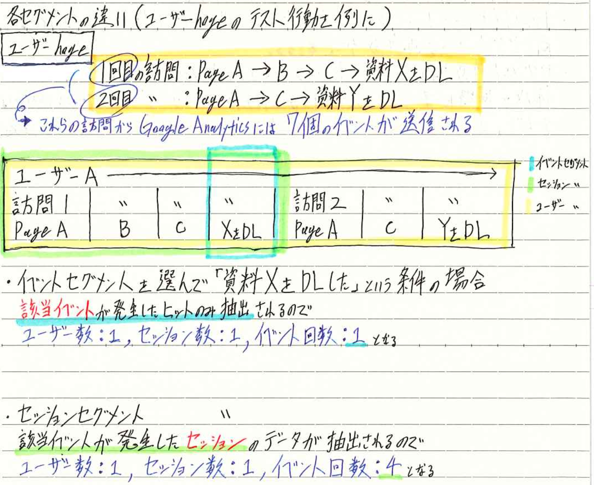
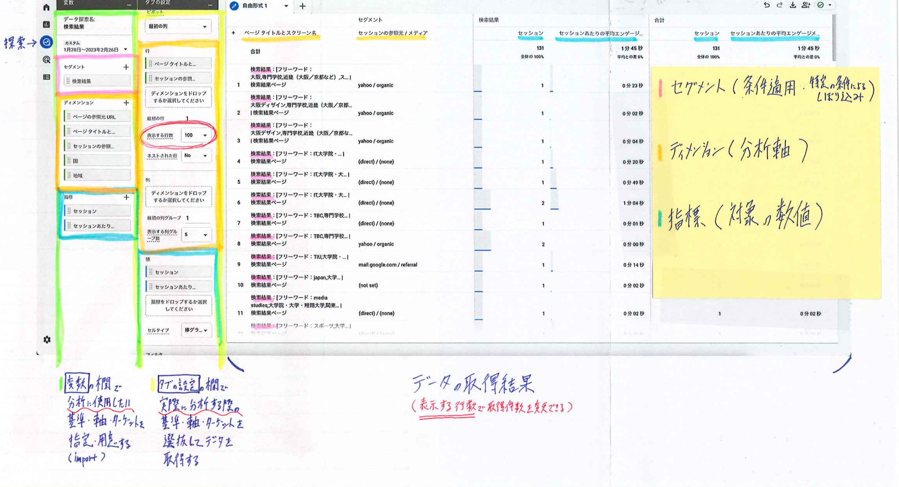

# 第2章 Google Analytics 4 (GA4) & GTM の基礎と仕様

**章概要**: GA4の計測軸（イベントベース）、推奨/カスタムイベント、サンプリング対策、セグメント仕様、GTM設定と2重計測防止、直帰率の計算式。

[← 総合目次（00_index.md）に戻る](00_index.md)

## 本章の節一覧

- [2-1. GA4の分析軸（ディメンション・セグメント・指標）とイベント仕様](#sec-2-1)
- [2-2. レポートの注意点（Other項目・サンプリング対策・SPA・動画計測）](#sec-2-2)
- [2-3. セッションタイムアウト・カスタムディメンション/指標の登録手順](#sec-2-3)
- [2-4. BigQuery設定（ストリーミング費用） & データストリーム](#sec-2-4)
- [2-5. セグメント（条件適用）機能の基礎と3つの単位（ユーザー・セッション・イベント）](#sec-2-5)
- [2-6. セグメント抽出結果の比較（ユーザーセグメント） & セグメントの仕様諸々](#sec-2-6)
- [2-7. レポート［ランディングページ］の解析手順（見方）](#sec-2-7)
- [2-8. GTMトリガー設定 & GA4の直帰率の計算式と定義](#sec-2-8)
- [2-9. 探索レポート画面の各設定項目 & ディメンション・指標・セグメントの役割](#sec-2-9)
- [2-10. サイト速度・OGP・UX & GTMとGAタグの併用不可（補足メモ）](#sec-2-10)

---

<a id="sec-2-1"></a>
## 2-1. GA4の分析軸（ディメンション・セグメント・指標）とイベント仕様

GA4では**分析軸（ディメンション）**を決めて、**どの角度（セグメント）から見るか**が大切。（イベント・ユーザー・セッション）

（レポート画面で）［フィルタを追加］or［比較対象を追加］でディメンション（分析軸）を調整していく。

### イベントの設定

☆イベントを用いる場合、Googleが用途に応じて利用推奨しているイベント名とパラメータがないか調べておく（`GA4 推奨イベント` でsearch）  
例: `login`, `purchase`, `share` ...

推奨イベントが無い場合、**カスタムイベントを作成する**（＋設定した条件を達成しておく）  
└ 作成後は一度条件を達成しないとイベント欄に表示されず＝CVとして設定できないので注意

> [!NOTE]
> ※大前提として GA4では計測軸が（UAの）セッションベースからイベントベースへ変更となっていることに注意。

### ［レポートのスナップショット］でよく見るレポートをカスタマイズしておく

#### ECサイトの設定例
- eコマースの収益 / eコマース購入数 / 購入者数 / 購入者の構成（前回の購入日別）
- 合計収益（参照元/メディア）
- イベント数（イベント名・ユーザーの合計数・ユーザーあたりのイベント数・イベントの収益）
- Googleのオーガニック検索クエリ
- セッション（デフォルトチャネルグループ） / CV（デフォルトチャネルグループ）
- ユーザーエンゲージメント

#### BtoBサイトの設定例
- Insights / CV（イベント） / PV数（ページタイトルとスクリーンクラス）
- ユーザー数（ユーザー・イベント数・CV・合計収益）
- ユーザーのアクティビティの推移
- 新しいユーザー（最初のユーザーの参照元/メディア）
- セッション（デフォルトチャネルグループ）
- Googleのオーガニック検索クエリ（Search Consoleとの連携が必要）

> [!NOTE]
> #### 相互参照・関連リンク
> - [2-9. 探索レポート画面の各設定項目 & ディメンション・指標・セグメントの役割](#sec-2-9): 探索画面のUI構成（変数・タブ設定・データ取得結果）

---

<a id="sec-2-2"></a>
## 2-2. レポートの注意点（Other項目・サンプリング対策・SPA・動画計測）

### ◎レポート画面の値に「other」が出てきたら注意

GA4でデータの組み合わせ（基数）が200万種類を超えると、`other`の項目が生まれる。この`other`の組み合わせには他の（順位の）組み合わせも含まれるので、`other`が出てきた場合は他の（順位の）データまで不正確になってしまう。

### ◎レポート画面でサンプリング率が低い場合、不正確になるので注意

各種または該当するレポート画面の右上にある［▼］でそのレポートのサンプリング率を見ることができる。サンプリングはデータ量が多い時等に発生する。サンプル率が低いとデータの精度が落ちるためサンプリングが発生しても期間などを短くして**50％以上**となるようにした方が良い。

### ◎SPA（Single Page Application）のサイトでの設定

［拡張計測機能］の［ページビュー数］の詳細設定から**「ブラウザの履歴イベントに基づくページの変更」をオフ**にしておく。  
そうしないと2重計測が発生する可能性がある。（デフォルトではオン設定）  
リアルタイムなどで実際に2重計測されているかどうかチェックしてみると良い。

### ◎GTMで動画計測の設定を行っていない場合

動画エンゲージメントを取得したいならYouTubeが発行する共有URL（動画リンク）にパラメータを追記する必要がある。

```html
<iframe width="..." height="..." src="https://www.youtube.com/embed/動画のリンク?enablejsapi=1"></iframe>
```

> [!NOTE]
> ※GTMでYouTubeの計測設定を行っている場合は上記は不要だが、トリガー設定で「すべてのYouTube動画にJavaScript APIサポートを追加する」がオンになっているか確認すること（デフォルトはオン）

> [!NOTE]
> #### 相互参照・関連リンク
> - [2-10. サイト速度・OGP・UX & GTMとGAタグの併用不可（補足メモ）](#sec-2-10): GTMとGAタグの併用不可についての補足メモ

---

<a id="sec-2-3"></a>
## 2-3. セッションタイムアウト・カスタムディメンション/指標の登録手順

### ◎セッションのタイムアウト設定

セッションのタイムアウトはデフォルトで30分。  
管理画面のデータストリーム内から ［ストリームの詳細］- ページ下部にある［タグ設定を行う］-［設定］-［すべて表示］-［セッションのタイムアウトを調整する］から**5分〜7時間55分の間で5分刻み**の設定が可能（タイムアウトを調整した後は［保存］をクリックすること）

### ◎独自の設定を施したカスタムイベント

独自の設定を施したカスタムイベントは**カスタムディメンションとして登録しないとレポートや探索で使用できない**。

#### カスタムイベント実装の手順
1. 取得したいデータの取得方法を決定する
2. 必要に応じてページやサイト内への記述の追加を行う
3. GTMで取得のための設定を行う（変数・トリガー・タグ）
4. 計測が正しく行えているかをチェック
5. カスタムディメンションとして登録

※手順内にあるように原則GTMを使って設定した方がベター

#### 設定例
任意の（箇所の）リンククリック計測、ページ内の特定の要素の表示、特定のURLパラメータのみを除外する（パラメータありとなし、両方のURLを見たい場合は［全URLパラメータを除外して別のイベントパラメータ名に設定］する方がベター）  
例: `'hash'`, `'email'`, `'utm_source'` ... ※`utm_campaign`など広告パラメータを使っている場合は流入元の分類が行える

※（カスタム）イベントを作成しないでパラメータだけを取得し、カスタムディメンションや指標として利用もできる

#### カスタムディメンション及びカスタム指標の上限（利用件数制限）

| 種類 | スコープ（有効範囲・単位） | 上限数 |
| :--- | :--- | :--- |
| カスタムディメンション | イベントスコープ | 50個まで |
| カスタムディメンション | ユーザースコープ | 25個まで |
| カスタム指標 | イベントスコープ | 50個まで |
| カスタム指標 | ユーザースコープ | 登録不可 |

> [!NOTE]
> #### 相互参照・関連リンク
> - [2-8. GTMトリガー設定 & GA4の直帰率の計算式と定義](#sec-2-8): GTMでのGA4設定と直帰率算出

---

<a id="sec-2-4"></a>
## 2-4. BigQuery設定（ストリーミング費用） & データストリーム

### ◎BigQueryの設定

データセットの作成でストリーミング形式を利用する場合**「200MBあたり$0.010」**の使用料が発生する（R5,2月）

### ◎データストリーム

プロパティ内で計測するデータの種類。  
└ **ウェブ / iOSアプリ / Androidアプリ** のいずれかを登録。  
この項目内から拡張計測機能などの各種設定を行える。

> [!NOTE]
> #### 相互参照・関連リンク
> - [2-1. GA4の分析軸（ディメンション・セグメント・指標）とイベント仕様](#sec-2-1): GA4の基本概念

---

<a id="sec-2-5"></a>
## 2-5. セグメント（条件適用）機能の基礎と3つの単位（ユーザー・セッション・イベント）

UA（旧GA）と異なりGA4におけるセグメントは**「探索レポート・機能」のみで利用できる**。他のレポート・機能内でセグメントは使用できないので注意。

### ※セグメントの3つの単位

- **1. ユーザーセグメント**: 該当する条件のユーザー全体の動きを見たい（（例）購入回数が3回以上のユーザーの閲覧ページランキング）
- **2. セッションセグメント**: 該当する条件の訪問内の行動も合わせて見たい（用途例: 特定の流入元から流入したセッションの閲覧ページを知りたい）
- **3. イベントセグメント**: 件数を数えたい（用途例: 特定のページで特定の行動を取った回数）

### 各セグメントの違い（ユーザーhogeのテスト行動を例に）



ユーザーhogeの行動:
- 1回目の訪問: Page A → B → C → 資料XをDL
- 2回目の訪問: Page A → C → 資料YをDL

これら2回の訪問からGoogle Analyticsには合計7個のイベントが送信される。

#### 条件「資料XをDLした」を指定した場合の抽出結果
- **イベントセグメントを選んだ場合**: 該当イベントが発生したヒットのみ抽出される → **ユーザー数: 1, セッション数: 1, イベント回数: 1**
- **セッションセグメントを選んだ場合**: 該当イベントが発生したセッション（1回目の訪問）全体のデータが抽出される → **ユーザー数: 1, セッション数: 1, イベント回数: 4**
- **ユーザーセグメントを選んだ場合**: 該当イベントを行ったユーザー（全訪問）のデータが抽出される → **ユーザー数: 1, セッション数: 2, イベント回数: 7**

> [!NOTE]
> #### 相互参照・関連リンク
> - [2-6. セグメント抽出結果の比較（ユーザーセグメント） & セグメントの仕様諸々](#sec-2-6): セグメントに関する仕様の諸々

---

<a id="sec-2-6"></a>
## 2-6. セグメント抽出結果の比較（ユーザーセグメント） & セグメントの仕様諸々

### 条件「資料XをDLした」でのユーザーセグメント抽出結果

**ユーザーセグメント**を選んだ場合:  
該当イベントが発生したユーザーのすべてのデータを抽出するので → **ユーザー数: 1, セッション数: 2, イベント数: 7** となる。

### ☆セグメントに関する仕様の諸々

- 作成したセグメントは**過去データに対しても反映できる**。
- 1つの探索レポートで作成できる最大のセグメント件数は**10件まで**。（新たな探索レポートを作成すると新規にセグメントは作成できる）
- レポートに同時反映できるセグメントは**最大4つまで**。
- 1つの探索レポートで作成したセグメントを別の探索レポートでは利用できない。同じセグメントでも再作成が必要となる。
- セグメント作成時に右上の「オーディエンスを作成する」を選ぶと、セグメント作成と同時にオーディエンス（特定の条件を満たしたユーザーグループ）を作成できる。  
  **ただし、オーディエンスは「ユーザーセグメント」でしか作成できないので注意。**

> [!NOTE]
> #### 相互参照・関連リンク
> - [2-5. セグメント（条件適用）機能の基礎と3つの単位（ユーザー・セッション・イベント）](#sec-2-5): セグメント機能の3つの単位と抽出例

---

<a id="sec-2-7"></a>
## 2-7. レポート［ランディングページ］の解析手順（見方）

（レポートの見方）

1. **① CVごとの数値を見る**  
   時系列での推移や流入元との掛け合わせによる成果貢献を測定。時系列の推移による特異点（急激な数値の増減があったタイミング）やどの流入元がCVに貢献しているかなど単純な数値の把握が行える（複雑な測定は探索レポートで行う）
2. **② ページごとの数値を見る**  
   「どのページが人気なのか？」「滞在やスクロールされている記事は？」などページ単位での傾向を把握する。①のCVごとの数値を見る同様に深掘りしたい場合は探索レポートの使用が必須。
3. **③ イベントごとの数値を見る**  
   主にユーザー行動の発生回数を確認することでサイトの利用傾向を把握する。①と②同様に詳しく分析したい場合は探索レポートの利用やカスタムイベントの登録が必要となってくる。

> [!NOTE]
> #### 相互参照・関連リンク
> - [3-1. 「分析」機能を担う探索内の手法の種類](03_ga4_exploration_reports.md#sec-3-1): 探索内の手法の種類

---

<a id="sec-2-8"></a>
## 2-8. GTMトリガー設定 & GA4の直帰率の計算式と定義

### GA4をGTMで作成する際のトリガー設定

GA4をGTMで作成する際、トリガーには「`Initialization - All Pages`」を選択する。  
`Initialization - All Pages` を使用すると他のトリガーより先に発動できるので、より確実な計測を実現できる。  
**注意点:** ただし、カスタムイベント計測などで変数の読み込みが発生する前に（`Initialization - All Pages` によって）GA4計測タグの読み込みが発生すると、変数の取得ができない場合もある。この場合は `Initialization - All Pages` から `All Pages` にトリガーを変更して計測できるか確認する。

### GA4における直帰率の定義と計算式

GA4における直帰率は **「1 - エンゲージメント率」** で算出される。  
＝ 直帰率とは「エンゲージメントしなかった割合」を指す。

UA（旧GA）のように「1ページだけ見てサイトを離脱した割合」という仕様で確認したい場合は、**セグメント機能**を利用する。

> **セグメント条件:** `page_view` が 1回 だったセッション（という条件適用）  
> 上記セグメントによって「1ページだけ見たセッション数（A）」を把握できるので、それをサイト全体のセッション数（B）で割算して算出する。  
> **計算式:** `(A ÷ B) × 100`

#### エンゲージメントの定義
- 10秒以上の滞在
- 2ページ以上の閲覧
- またはスクロールイベントの発生 / 1つ以上のCV（コンバージョン）イベントの送信

> [!NOTE]
> #### 相互参照・関連リンク
> - [2-10. サイト速度・OGP・UX & GTMとGAタグの併用不可（補足メモ）](#sec-2-10): GTMとGAタグの併用不可ルール・2重計測防止

---

<a id="sec-2-9"></a>
## 2-9. 探索レポート画面の各設定項目 & ディメンション・指標・セグメントの役割

### 探索画面のUI構造



- **「変数」の欄**: 分析に使用したい基準・軸・ターゲットを指定・用意する（import）
- **「タブの設定」の欄**: 実際に分析する際の基準・軸・ターゲットを選択してデータを取得する。
- **データの取得結果**: （表示する行数で取得件数を変更できる）

### 各設定項目の概念定義

- **セグメント（条件適用）**: 特徴的な条件による絞り込み
- **ディメンション（分析軸）**: 分析する切り口・属性（例: ページタイトルとスクリーン名、セッションの参照元/メディア など）
- **指標（対象の数値）**: 測定する定量データ（例: セッション数、セッションあたりの平均エンゲージメント時間 など）

### GA4におけるデータ解釈の心得

GA4では知りたいデータ・内容を**自分で用意する**必要がある。  
（上記は「検索結果の内容」と「どういった検索内容が比較的長く見られているか」「比較的短い時間の検索結果の内容に特徴はあるか」を知るための探索レポートの一例。  
└ 例: TBC, Japan, TIUなど固有名詞が含まれている  
└ 最初から知りたいことが決まっているユーザー）

> [!NOTE]
> #### 相互参照・関連リンク
> - [3-1. 「分析」機能を担う探索内の手法の種類](03_ga4_exploration_reports.md#sec-3-1): 探索内の手法の種類
> - [2-3. セッションタイムアウト・カスタムディメンション/指標の登録手順](#sec-2-3): カスタムディメンション・指標の登録

---

<a id="sec-2-10"></a>
## 2-10. サイト速度・OGP・UX & GTMとGAタグの併用不可（補足メモ）

### サイト・ページの読み込み（表示）時間と直帰・離脱率

サイト・ページの読み込み時間は直帰・離脱率に大きく関与してくる。（集客 / 閲覧 / 誘導 / 成果のいずれにも関わってくること）。

- 課題解決にはGoogleの『PageSpeed Insights』を活用するのも手。
- ※データ（書籍P218）では、表示まで約2〜5秒くらいまでなら耐えて（待って）くれる印象。**10秒以上は絶望的**。
- ビュー（レポート）でページの速度が見たい場合は、［行動］→［サイトの速度］→［ページ速度］を選択する。（右上のアイコン（データ）を選ぶと、閲覧保有数が全て見れる） ―UAは2023/7 終了

> [!NOTE]
> **LPO (Landing Page Optimization: ランディングページ最適化)** にも直結する。

### 優良ページ（コンテンツ）の量産について

直帰率・離脱率の低いページを参考にして優良ページの増加に努める（レイアウト / デザイン / 導線 / テキスト（記述）など参考ポイント。インタビュー形式や第三者目線形式など）。

### OGPを設定してSNSからの流入（Social）を増やす（CTR向上を図る）

OGP (Open Graph Protocol) が設定されていると、Facebookで「いいね！」された時やタイムラインにサムネイル画像付きで記事の情報を表示させられるなど、Webサイトへの流入増を期待できる。※WordPressでは「WordPress SEO by Yoast」というプラグインを使えば設定が楽。

### （主にWebアプリだが）コンテンツ作成やデザインを通じたUXを意識する

訪問者に飽きられないように常に新しい情報を発信し続けたり、必要に応じてデザイン（or UI）を変えたりなど新しい体験（新鮮味）の提供が大事。

### ☆Googleタグマネージャー（GTM）とGoogle Analyticsのタグは併用不可

Google Analytics（ユニバーサルアナリティクス）のトラッキングコードはGoogleタグマネージャー（GTM）を利用して設置できる。つまり**GTM上で設定している状態で（GTMのコードを埋め込んでいる状態）HTMLソースにユニバーサルアナリティクスのトラッキングコードを直書き（埋め込み）してしまうと、GTMとGoogle Analyticsの「2重計測」になってしまうので併用してはならない**。

> **既にGoogle Analyticsで計測しているものをGTMに移行する場合の注意点:**  
> GTMのコードとGAのコードを併記 → GTMの設定が完了するまで一時的に2重計測  
> GTMのコードに差し替え → GTMでの設定が完了するまでの間、計測が抜け落ちる

> [!NOTE]
> #### 相互参照・関連リンク
> - [2-2. レポートの注意点（Other項目・サンプリング対策・SPA・動画計測）](#sec-2-2): サンプリング・SPA設定・動画計測
> - [2-8. GTMトリガー設定 & GA4の直帰率の計算式と定義](#sec-2-8): GTMトリガー設定と直帰率定義
