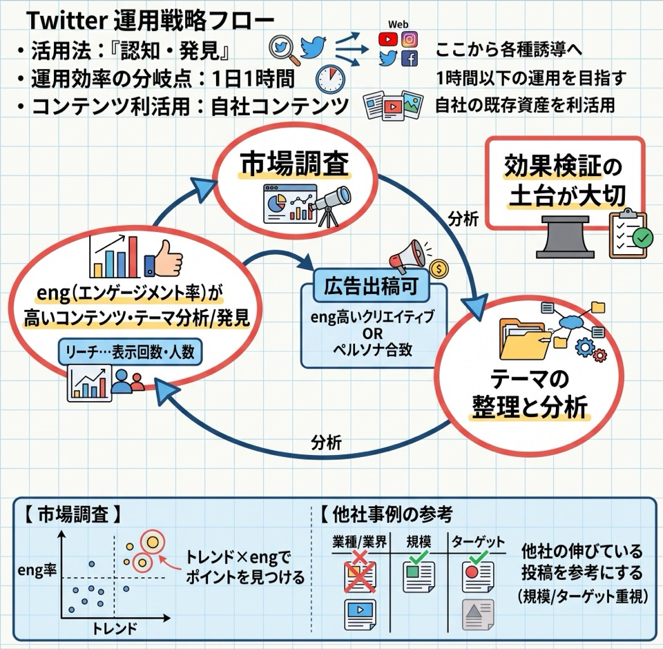

# 第4章 SNS運用・マーケティングとデータ活用

**章概要**: SNS運用の基本、運用分岐点（1日1時間）、市場調査×eng、UGC活用、KPI目安（CTR・CVR）、年齢層別SNS特性、目的別解析と炎上対応。

[← 総合目次（00_index.md）に戻る](00_index.md)

## 本章の節一覧

- [4-1. SNS（Twitter/X関連）運用の基本とサイクル](#sec-4-1)
- [4-2. エンゲージメントの高いコンテンツ・UGC活用・ターゲット別SNS](#sec-4-2)
- [4-3. SNS解析の目的別見るポイント & 炎上に対する基本対応](#sec-4-3)

---

## 4-1. SNS（Twitter/X関連）運用の基本とサイクル

### Twitter運用の基本心得

- Twitterは**「認知・発見」**に活用するもので、そこから各種へ誘導するのに効果的。
- **1日1時間**が運用効果 / 効率の分岐点。
- 自社コンテンツ（記事・動画・画像など）を利活用していく。

### 運用・検証のサイクル（効果検証の土台が大切）

1. **① 市場調査**（トレンド × eng を軸にポイントを見つける）
2. **② テーマの整理と分析**
3. **③ engが高いコンテンツ・テーマを分析/発見**

リーチ…表示回数/人数

> [!NOTE]
> ※engの高かったクリエイティブ OR ペルソナに合ったものは広告出稿しても良い

### 市場調査のポイント

**トレンド（よこ軸） × eng（たて軸）** を軸にポイントを見つける。  
他社の伸びている投稿内容（コンテンツ）を参考にする（業種や業界は問わないが、規模やターゲットが似ていることが大切）。

### テーマの整理と分析

最新・トレンドのものを投下すればいいわけではなく、**ペルソナ（ターゲット）に合ったコンテンツを生成 / 投下するのが大切**。  
豆知識（へぇ〜と思うもの）や由来（歴史）が eng 高め？？（もちろん関連、派生キーワード・テーマでおこす！）  
（広告的投稿と学び的発信/投稿のバランスが重要？）

> [!NOTE]
> #### 相互参照・関連リンク
> - [4-3. SNS解析の目的別見るポイント & 炎上に対する基本対応](#sec-4-3): SNS解析の目的別見るポイント（認知・接点・集客）と炎上対策
> - [4-2. エンゲージメントの高いコンテンツ・UGC活用・ターゲット別SNS](#sec-4-2): engの高いコンテンツ・UGC・属性

---

## 4-2. エンゲージメントの高いコンテンツ・UGC活用・ターゲット別SNS

### 高インプレッション・高エンゲージメントの傾向

- ☆「不特定多数」に該当し、かつ関わりが深そうな事柄（災害など）は **IMP数高い**
- ☆ウンチク関連は **eng も高くなる傾向**
- ☆時事性の高い内容も高くなる（IMP + eng）傾向。（多くの人が知っていると尚良し）
- ☆「#〜の日」というハッシュタグ

### engの高いコンテンツ

- eng率のみならず「（見られている）時間帯」も大切。（時間帯の違いでengが動くものかどうか）
- **UGC（User Generated Content: ユーザー生成コンテンツ）への意識**  
  ユーザーの手によって生成・制作されたコンテンツ（UGC）は、購買意欲喚起（訴求効果）に大きな影響を与えるため。  
  ※63%が購入前に商品のUGCを探しているデータがある。「口コミ効果」
- 直近のフォロワー属性を把握して、コンテンツ制作のテーマに含む。
- **プロフィールアクセス数 ÷ インプレッション ＝ 2%以上** であれば良いツイートの目安。

### メモ・基準値（KPI目安）

- ペルソナが不明 or 設定が難しい場合は、年代や性別で区分して広告を出稿して反響率 / 具合で判断するのも一手。広告出稿時の平均CVRは `0.6〜1%` くらい。
- 「いいね」や RT のアクションを毎日行う傾向が多い（投稿はしなくともアクションはしている人が多い）。
- 平均CTRの目安は（インプレッションに対して） `0.8〜1.5%` 程度。
- サイト・ページのURLリンクはリプライに入れる（？） ← テストしたが効果的ではない印象。

### 年齢層別のSNS特性

- **Facebook**: 中高年向け
- **Instagram / Twitter**: 若年層向け（10〜20代特化は TikTok）

> [!NOTE]
> #### 相互参照・関連リンク
> - [4-1. SNS（Twitter/X関連）運用の基本とサイクル](#sec-4-1): SNS運用の基本と市場調査
> - [4-3. SNS解析の目的別見るポイント & 炎上に対する基本対応](#sec-4-3): SNS解析の見るポイントと炎上時の基本対応

---

## 4-3. SNS解析の目的別見るポイント & 炎上に対する基本対応

### SNS解析は目的別に見るポイントが異なってくる

| 目的 | 見るポイント | 補足 |
| :--- | :--- | :--- |
| ① 認知拡大 | 閲覧数・言及数（リーチ・IMP数） | 「Yahoo!リアルタイム検索」でキーワード検索してチェック |
| ② ユーザーとの接点確保（コミュニケーション重視） | エンゲージメント率 | ユーザーからのポジティブな意見を現場へ反映してモラルUPを図るなど |
| ③ 販売・集客 | リンククリック数（ECサイト or LPなどへの） | — |

※認知拡大には「フォロワー数」の多さも大切になってくるなど、上記のポイントのみならず目的・目標に応じて他のポイントと関連したりする。  
→ サイト解析と同様に**「本来の目的・目標」を見失わないことが大切**。

### 炎上に対する基本的な対応

- すぐに投稿内容にまつわる事実関係を調査し、「世の中を騒がせた点」について取り急ぎ謝罪する。
- 加えて、投稿内容に不適切な点があったことについて真摯に反省している姿勢を伝える。
- （採用関連など）「企業組織の問題・体質」にまで派生しそうなケースの時は、「企業組織の問題として捉えて取り組む姿勢」を見せることも重要。（☆別途、謝罪文のプレスリリースを作ってプレスリリース等で発信）

> [!NOTE]
> #### 相互参照・関連リンク
> - [4-1. SNS（Twitter/X関連）運用の基本とサイクル](#sec-4-1): SNS運用の基本と市場調査
> - [4-2. エンゲージメントの高いコンテンツ・UGC活用・ターゲット別SNS](#sec-4-2): engの高いコンテンツとKPI目安
